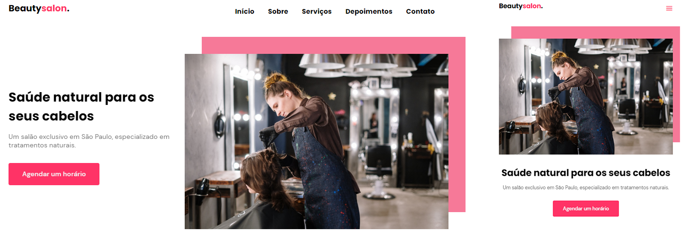

<h1 align="center">BeautySalon</h1>

Projeto criado durante a Next Level Week #6 da <a href="https://www.rocketseat.com.br/">Rocketseat</a>, missão Origin.

[= Demo](https://yellowmoonastronaut.github.io/BeautySalon/)

#### Tipo de estilização:
- Mobile Frist
#### Tecnologias utilizadas:
- HTML
- CSS
- JavaScript
    - ScrollReveal
    - Swiper
- Github para hospedagem

 

#### Projeto Finalizado!

 

### Made by

    
    

        <h3>Willian Igor</h3>
        <a href="https://github.com/Willianprof" target="_blank">Github</a>
    

